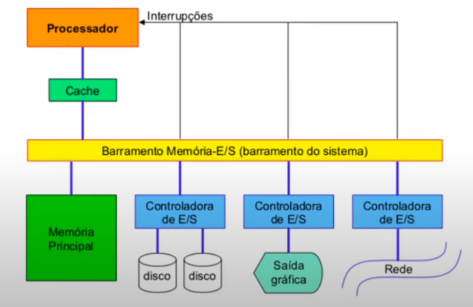
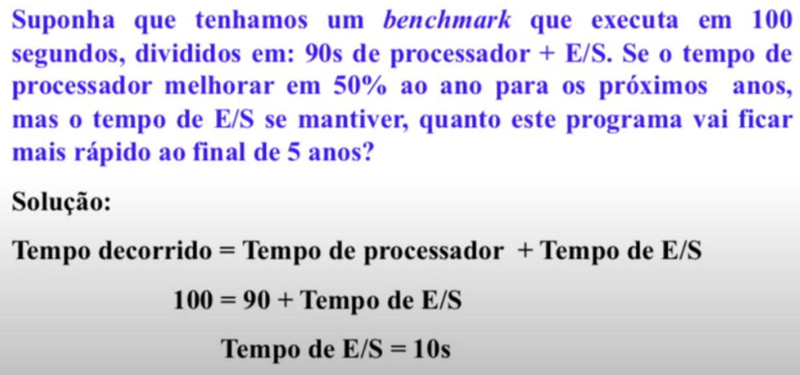
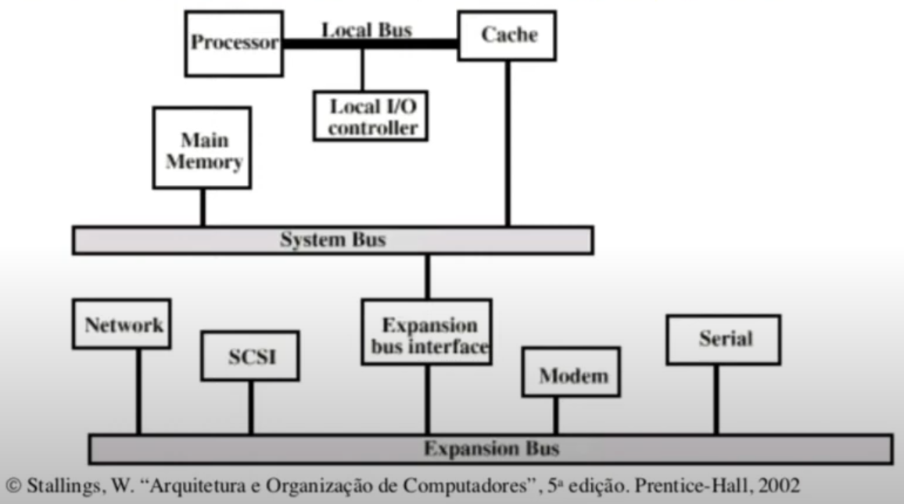
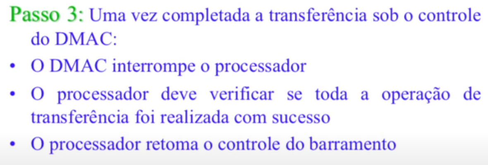

# Dispositivos de Entrada/Saída

## Topologia de um Sistema Computacional Típico

Modelo Von Neumann

Todos os componentes do sistema têm influência nos desempenhos das tarefas
necessárias à realização da E/S:

* Dispositivos
* O Processador
* O software básico
* A hierarquia de memória

Na época atual todas as máquinas usam processadores integrados feitos com a 
mesma tecnologia:

* O diferencial das máquinas é o sistema de E/S 

---

As dificuldades em se estimar o desempenho e se projetar um sistema de E/S têm 
muitas vezes, sido relegas a segundo plano

* As pesquisas importantes têm focado os processadores
* Muitas vezes os fabricantes de computadores apresentam suas medidas de 
desempenho considerando somente o processador 
* As disciplinas dos cursos de Ciência da Computação constumam das pouca 
importância aos sistemas de E/S 

---

A maior parte das características dos sitemas de E/S dependem da tecnologia

Por exemplo, as propriedades dos drives de disco afetam:

* A maneira como os discos devem ser conectados ao processador
* O modo como o SO interage com os discos

Porém, os sistemas de E/S precisam levar em conta outras características 
específicas, além do desempenho:

* Expansibilidade / Escalabilidade
* Capacidade de recuperação na presença de falhas

> Note que drive != driver  

---

O desempenho de um sistema de E/S é mais complexo de se estimar do que 
o desempenho dos processador

* Para alguns dos dispositivos de E/S a ***latência de acesso*** é a característica 
mais importante
* Para outros, o ***throughput*** é mais importante

---

O desempenho dos dispositivos de E/S depende de aspectos sistêmicos:

* As características do dispositivo 
* A conexão entre o dispositivo e o resto do sistema
* A hierarquia de memória
* O SO 

---

#### Exemplo 

* Essa fórmula define o tempo gasto pelo processador em $n$ anos

$$t_n = \frac{t_0}{(1+C)^n}$$

onde

* $t_n$ = tempo gasto na tarefa daqui a $n$ anos
* $t_0$ = tempo gasto na tarefa anualmente
* $C$ = melhora anual, nesse caso $0,5$ $(50\%)$
* $n$ = número de anos

---

### Impacto do Sistema de E/S no Desempenho 

* Em alguns ambientes, o ***throughput*** do sistema é o fator mais importante 
(***banda passante*** é preponderante)
* Há duas maneiras de se medir a banda passante do sistema de E/S  

1. Pela quantidade de dados que podem ser movidos através do sistema em determinado 
intervalo de tempo
2. Pelas operações de E/S que podem ser realizadas pela unidade de tempo

A escolha da medida mais apropriada depende do ambiente/da aplicação 

* Massa de dados *vs* muitos arquivos a serem processados

---

* Em outras aplicações o tempo de resposta é mais importante 
* Tempo de respostas é o tempo decorrido para a realização da tarefa
* Na maioria dos ambientes, grande parte dos acessos é para pequenos arquivos
> Portanto, um sistema de E/S com menor latência por acesso vai fornecer melhor 
tempo de resposta

* Em máquinas com um único usuário o **tempo de resposta** é o principal responsável pelo
desempenho

--- 

* Um grande número de aplicações no mercado comercial da computação requer tanto alto 
***throughput*** quanto pequeno ***tempo de resposta***:
> * Caixa eletrônico
> * Sistema de reserva de passagens
> * Sistemas de controle de inventário
> * Servidores de arquivos
> * Máquinas para trabalhar com usuários em tempo compartilhado

Como compararmos diferentes sistemas de E/S 

* Difícil responder porque o desempenho de um sistema de E/S depende de muitos aspectos 
do sistema 
* Aplicações diferentes põem em evidência aspector diferentes
* Um sistema pode ter que privilagiar o ***tempo de resposta*** ou o ***throughput***
* Logo, é razoável considerar os dois aspectos

---

Como reduzir o tempo de resposta?

* o ***tempo de resposta*** pode ser minimizado se tratarmos uma solicitação de E/S 
tão cedo quanto possível

Como aumentar o ***throughput***

* o ***throughput*** maior pode ser obtido se juntarmos as solicitações que tiverem 
alguma relação entre si 
* exemplo:
> * Podemos aumentar o ***throughput*** de um disco se agruparmos as solicitações de 
acesso a endereços próximos uns dos outros 
> * Mas esta medida vai aumentar o ***tempo de resposta*** de algumas solicitações 

### Medidas de desempenho da E/S 

Os benchmarks para tais medidas são afetados por um conjunto de características do  
sistema, tais como:

* Tecnologia do disco
* Como os discos são interligados ao sistema 
* O sistema de memória 
* O processador 
* O sistema de arquivos provido pelo SO 

---

O desempenho dos sitemas de E/S depende da taxa na qual o sistema pode transferir
dados (a ***taxa de transferência***)

A ***a taxa de transferência*** depende da frequência do relógio

A ***taxa de transferência*** é expressa em $MB/s$

Porém, nos sistemas de E/S, $MB/s$ são medidos na **base 10**  
$1MB = 10^6 = 1.000.000 bytes$

Nas medidas de capacidade de memória, a **base 2** é a usada  
$1MB = 2^{20} = 1.048.576bytes$

---

Benchmarks para E/S nos supercomputadores

* E/S nos supercomputadores é dominada pelo acesso a arquivos imensos armazenados em 
discos magnéticos

* Programas rodam por horas

* E/S consiste em uma leitura de dados, seguido de escritas que mostram o estado do 
Programas

* Logo, **um supercomputador escreve mais do que lê**

* Medida a ser usada neste caso é o ***throughput de dados***: o número de bytes por 
segundo que pode ser transferido entre a memória principal e os discos

---

Benchmarks para E/S de Sistemas para Processamento de Transações

* Este tipo de aplicações necessitam tanto de bom ***throughput*** quanto bom ***tempo 
de resposta***

* A maioria dos acessos de E/S é para uma pequena quantidade de dados

* Processamento de transações tem mais a ver com ***taxa de E/S*** medida como número de 
acessos ao disco por segundo (do que com **taxa de dados**, medida em bytes por segundo)

* Envolvem modificações em uma grande base de dados (tempo de resposta enquanto **tolera
certos tipos de falhas**)

* Aplicaçõoes extremamente críticas e sensíveis ao custo

* Os bancos usam sistemas de processamento de transações porque elas respondem bem a 
uma série de características
> * Certeza de que transações não são perdidas
> * Rapidez no tratamento de transações 
> * Minimização do custo para tratamento de uma transação 

--- 

## Barramentos

Os diversos subsistemas de um sistema computacional precisam ter interfaces uns com os 
outros:

Conceito de barramento:

* é um *link*/canal de comunicação compartilhado

Vantagens de uma comunicação via barramento

* Versatilidade (fácil inclusão de novos dispositivos)
* Baixo custo (conjunto de fios é compartilhado por dispositivos)

Desvantagem

* Gargalo de comunicação (limitação no *throughput*)

Fatores físicos que limitam a velocidade do barramento

* Comprimento do barramento
* Número de dispositivos conectados

O barramento precisa suportar uma gama ampla de dipositivos, com **latências** e 
**velocidades** distintas

---

### Composição de um barramento

Linhas de Controle 

* Sinalizam requisições (REQ) e reconhecimento de requisições (ACK) (protocolo de 
comunicação do barramento 
* Indicam o tipo de dado que esta nas linhas de dados 

Linhas de Dados 

* Transportam a informação da fonte ao destino 
* Informações  =  **dados**, **comandos complexos** ou **endereços**
* Alguns barramentos tem dois conjuntos de linhas: um para dados e outro para endereços 

### Transação com o barramento (bus transaction)

Envolve dois passos

1. Envio do endereço 
2. Envio ou recepção dos dados 

Definindo operações de entrada e de saída 

Os Três Passos de uma Operação de Sáida

Os Dois Passos de uma Operação de Entrada

### Tipos de Barramento 

Classificação usual

* Barramento processador-memória
* Barramento de E/S 
* Barramento do *backplane*

Barramento processador-memória 

* Curtos, com alto desempenho
* Maximizam a banda passante memória-processador 
* Geralmente, são proprietários do fabricante de processaor e/ou máquina 

Barramento de E/S 

* Mais longos
* Podem ter muitos tipos de dispositivos conectados a eles 
* Precisam atender a uma ampla faixa de bandas passantes (levando em conta dispositivos 
que venham a ser conectados) 
* Não necessarimente têm interface direta com a memória 
* Podem usar o barramento processador-memória ou o barramento do *backplane* para se 
comunicar com a memória principal
* São padronizados
* Apresentam uma interface moderadamente simples e de baixo nível (pouca eletrônica 
adicional necessária ao dispositivo)

Barramento de *backplane*

* Projetados para permtir que processador, memória e dispositivos de E/S possam coexistir 
em um único barramento físico 
* Balanceiam as demandas de comunicação **processador-memória** com as demandas de 
comunicação **dispositivos de E/S-memória**
* Muitas vezes são construídos diretamente no *backplane* da máquina (placa-mãe) 
* São padronizados 
* Necessidade de uma lógica adicional para interface barraemtno de 
*backplane*-dispositivo 

### Sistema de Barramentos Tradicional ISA com Cache

### Sistema de Barramentos de Alto Desempenho

> hierarquia de barramento 

Barramentos síncronos 

* O *clock* é um dos sinais de controle 
* Possui um **protocolo de comunicação relacionado ao** ***clock***
* Protocolo simples, conhecido e implementado por um circuito (máquina de estados) 
* Desvantagem 1: os dispositivos devem trabalhar na mesma frequência de *clock*
* Desvantagem 2: devido ao *clock skew* ("escorregamento"), barramentos síncronos 
não podem ser muito longos

> Barramentos processador-memória são majoritariamente síncronos!

Barramentos assíncronos

* Não segue o *clock*
* **pode acomodar uma grande variedade de dispositivos** (não exige sincronismo entre 
os dispositivos)
* Menor preocupação com o comprimento das linhas (podem ser longos) 
* Protocolo ***handshake*** coordena a transmissão dos dados entre transmissor e 
receptor (transmissor e receptor só passa para um passo seguinte quando ambas as partes
concordam)
* O protocolo é implementado por meio de um conjunto adicional de linhas de controle

#### Handshake 

Suponha que um determinado dispositivo requisitou uma palavra de dados ao sistema de 
memória 

Suponha que estão disponíveis três linhas de controle 

* **ReqLeit**: usada para indicar uma solicitação de leitura da memória principal. O 
endereço da leitura é colocado nas linhas de dados no mesmo instante que o sinal 
indicativo da solicitação fica ativo

* **DadoPrt**: usada para indicar que a palavra de dados está pronta para ser lida, 
colocada nas linhas de dados 

* **Ack**: sinal usado para reconhecer o **ReqLeit** ou o **DadoPrt** da outra parte 
envolvida na comunicação

---

Escolha entre barramentos assíncronos e síncronos tem implicações outras além da 
banda passante 

* Distância física entre os componentes do sistema 
* Número de componentes 

Barramentos assíncronos 

* São menos sensíveis a mudanças tecnológicas 
* Podem suportar dispositivos com tempos de resposta bastante diversos 
* Barramentos de E/S são majoritamente **assíncronos** 

Além do modo de funcionamento (síncrono *vs* assíncrono), fatores que afetam a banda 
passante dos barramentos: 

* **Tamanho do Barramento**: mais de uma palavra pode ser transferida por ciclo de clock 

* **Linhas de endereço e linhas de dados separadas** ***versus*** **multiplexadas**: em 
uma escrita, endereço e dado podem trafegar simultaneamente 

* **Transferência de blocos**: quando palavras de endereços contíguos são transferidas, 
somente o endereço da primeira palavra precisa ser enviado (transferência "em rajadas" 
ou modo "burst") 

## O papel do Sistema Operacional

O Sistema Operacional é o principal responsável pelo tratamento da E/S 

* Garante que o programa do usuário somente acesse os dispositivos de E/S para os quais 
o programa de usuário tenha permissão 
* Fornece rotinas de manipulação das operações de baixo nível dos dispositivos de E/S 
* Trata as interrupções geradas pelos dispositivos (da mesma maneira que trata as  
exceções geradas por um programa)

Tipos de comunicação do SO com os dipositivos de E/S: 

* **polling**: Envio de comandos para os dispositivos de E/S 

* **interrupção**: O dispositivo deve poder avisar ao SO o térmico de uma operação 
(ou erro) 
1
* **acesso direto à memória (DMA)**: dados devem ser transferidos entre a memória e os dispositivos de E/S de maneira rápida

--- 

Métodos de endereçamento 

* Para dar um comando a um dispositivo de entrada/saída, o processador precisa ser 
capaz de endereçar o dispositivo 

Existem dois métodos para endereçar dispositivos 

* Entrada/Saída mapeada na memória 
* Entrada/Saída independente (com comandos especiais de entrada/saída)

Entrada/Saída Mapeada na Memória 

* Parte do espaço de endereçamento é reservado aos dispositivos de entrada/saída 
* Leituras e escritas envolvendo estes endereços são interpretadas como comandos 
* Uma operação de escrita na memória é usada para enviar dados para um dispositivo de 
E/S 
* Barramento não precisa ter linhas especiais para comandos (somente para leitura e 
escrita) 

 Entrada/Saída Independente 

 * Barramento possui linhas de comandos de entrada e saída 
 * Uma linha de comando especifica se um endereço corresponde a uma posição de memória 
 ou a um dispositivo de E/S 

--- 

Comandos de Entrada/Saída 

* **Controle**: Ativar um periférico e indicar uma ação a ser executada 

* **Teste**: testar várias condições de estado 

* **Leitura**: fazer com que o dispositivo de E/S obtenha um item de dado do periférico,
armazenando-o no registrador de dado 

* **Gravação**: faz com que o dispositvo de E/S obtenha um item de dado (byte ou palavra)
do barramento de dados, transmitindo-o para o periférico

--- 

**Transferência com polling**

Overhead do Polling em um sistema de E/S 

Supondo que o número de cíclos de *clock* para uma operação de polling, incluindo a 
transferência para a rotina de polling, acesso ao dispositivo e a transferência para o 
programa do usuário é 400, e que o processador executa a 500MHz.

Determine a fração do tempo do processador gasto com o polling em duas situações 
diferentes: 

1. O mouse precisa ser amostrado 30 vezes por segundo para garantir que não haverá  
perdas no movimento do usuário. 

$$ N_{ciclos}\space entre \space pollings = 30 \times 400 = 12.000 \space ciclos \space
por segundo$$

$$ Fração \space de \space ciclos \space do \space clock \space do \space processador 
\space consumidos = \frac{12 \times 10^3}{500 \times 10^6} = 0,002\%$$

> logo, polling pode ser usado para o mouse sem impacto na performance do processador

2. A unidade de disco rígido transfere dados em unidades de quatro palavras a 4MB/s, 
e nenhum dado pode ser perdido. 

$$ N_{pollings} = \frac{4MB/s}{16 \space bytes} = 250K vezes/s$$

$$ Ciclos \space por \space segundo \space para \space o \space polling = 250K \times 
400 = 100M $$

$$ Fração \space de \space ciclos \space do \space clock \space do \space processador 
\space consumidos = \frac{100 \times 10^6}{500 \times 10^6} = 20\%$$

> Cerca de um quinto do tempo de processador seria usado para efetuar o polling, logo,
o uso do polling neste caso é inaceitável 

---

**Transferência com interrupção**

 
E se houver mais de uma interrupção a ser atendida?

* Usar interrupções com prioridades 
* E para interrupções de mesma prioridade?
> Fazer polling entre elas

* OBS: nas transferências por polling e por interrupção 
* O processador controla totalmente a transferência 
* Os dados passam por dentro do processador (usando seus registradores!)

Vantagem das transferências por interrupção sobre polling 

* Ausência do overhead quando o dispositivo não estiver efetivamente transferindo dados 
* Uma vez que o SO tenha iniciado uma operação em um dispositivo, ele precisa ser 
"pollado" constantemente, pois o SO desconhece quando o dispositivo vai responder 

Desvantagens das transferências por polling 

* Taxa de transferência limitada pela velocidade que o processador pode testar e servir 
o dispositivo 
* O processador se ocupa de gerenciar a transferência de dados de E/S, tendo que executar
várias instruções a cada transferência 

--- 

Acesso direto à memória 

* A técnica de DMA libera o processador de acompanhar todos os passos de uma 
transferência 

* Exige um recurso de hardware especial, o ***controlar de DMA(DMAC)***

Um controlador de DMA pode ter mais de um canal: 

Neste caso, cada canal possui 

* Um par de sinais de requisição e confirmação 
* Um conjunto de registradores 

Em caso de conflitos, é seguida uma ordem de prioridades 

**Comparativo de Desempenho**

Desvantagem do DMA

* O overhead da controladora de DMA (DMAC) 

* Este overhead pode ser muito alto em relação ao número de informações a serem
transferidas 

> não vale a pena inicializar o DMA pra transferir uma palavra, só uma quantidade grande 
de informação

