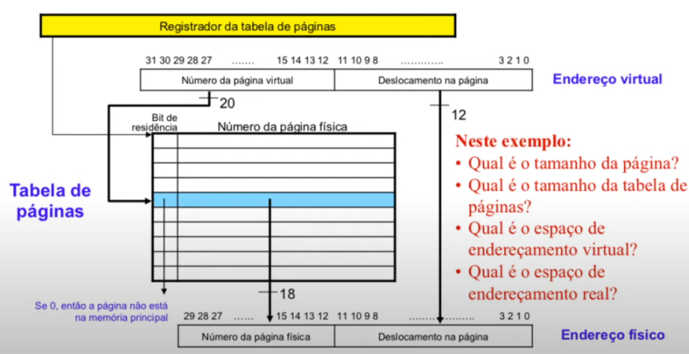
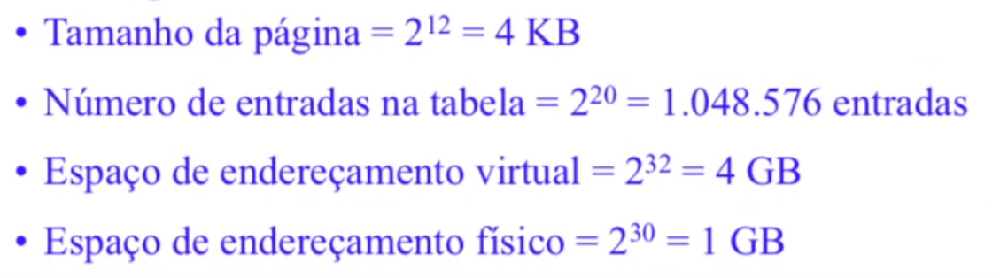

# Memória Virtual

[Wikipedia Page](https://en.wikipedia.org/wiki/Virtual_memory)
[Linux-VM-notes](https://github.com/lorenzo-stoakes/linux-vm-notes/blob/master/sections/page-tables.md)

## Introdução

### Memória Principal (DRAM)

* Tamanho limitado (máximo, 1GB no MIPS, que possui endereços físicos de 30 bits)
* Tempo de acesso da ordem de nano segundos

---

### Memória Secundária (disco magnético)

* Grande capacidade de armazenamento (milhares de GBs)
* Tempo de latência da ordem de mili segundos 

> Quando um programa é executado, a primeira coisa que o sistema operacional faz 
é colocar o programa na memória 

Pode não ser possível manter um programa inteiro na memória principal. 

Pior: deseja-se rodar vários programas "ao mesmo tempo" 

* *Solução*: manter apenas as partes ativas do(s) programa(s)

---

### Memória Virtual 

**Memória virtual** é a **técnica que dá ao programador a ilusão de poder acessar 
rapidamente um grande espaço de endereçamento**

Objetivos da técnica:

* **Segurança**: permitir que haja um meio seguro de eficiente de se compartilhar 
informações, armazenadas na memória, entre vários programas 

* **Tamanho**: Minimizar os problemas causados aos programas pela existência de 
uma pequena quantidade de memória principal

> Também funciona com *localidade temporal e espacial*

Os programas que compartilham a memória de determinada máquina mudam 
dinamicamente durante o processo de execução 

Cada programa deve ser compilado usando seu próprio **espaço de endereçamento** 
(ou seja, em uma **região da memória acessível somente a esse programa**) 

A técnica de memória virtual realiza a **tradução do espaço de endereçamento de 
um programa para seus endereços reais**

Antigamente, os programas eram divididos em pedaços 

Os pedaços mutuamente exclusivos (**overlays**) eram identificados pelos 
programadores

A carga/exclusão de **overlays** da memória era realizada sob controle do prório 
programa 

> carrega essa parte agora carrega essa parte

Esta tarefa era demasiadamente pesada para os programadores 

A técnica de memória virtual foi desenvolvida para **livrar os programadores  
dessa atribuição**

*A técnica de memória virtual permite que o tamanho de um único programa exceda 
a quantidade total de memória real disponível para sua execução*

A ténica de memória virtual **gerencia automaticamente os dois níveis de 
hierarquia: memória principal(física) e memória secundária**

Os **conceitos** que regem a técnica de memória virtual **são os mesmos 
utilizados para as caches**, no entando, a terminologia usada é diferente

--- 

### Conceitos envolvidos em Memória Virtual  

**Página**: é um bloco de tamanho fixo

> o que na cache era um bloco aqui é uma página

**Falta de página**: é uma falta no acesso à memória virtual 

**Usando memória virtual**: o processador sempre gera um *endereço virtual*, que 
é traduzido para um *endereço real* por meio da *MMU(Memory Management Unit)*, 
que é um sistema *HW + SW* 

O endereço real (também chamado de *físico*) é, então, usado para acessar a 
memória 

---

### Memória Virtual e Relocação de Código 

A ténica de memória virtual **simplifica a carga dos programas para excução, a 
partir da** *relocação* 

A relocação **mapeia os endereços virtuais usados por um determinado programa em 
endereços físicos (antes de tais endereços serem usados para acessar a memória)**

A técnica de relocação **permite que um programa seja carregado em qualquer 
posição da memória principal**

**Todos os sistemas de memória virtual atuais relocam os programas por meios de 
blocos de tamanho fixo, as** *páginas* 

---

### Endereço Virtual 

O endereço virtual é dividido em duas partes: **número da página virtual** e 
**deslocamento da página**

O número da página física constitui a parte superior do endereço físico, enquanto
o deslocamento da página compõe a parte inferior  

---

### Mapeamento de um endereço virtual em um endereço físico

> Vitualmente 4GB e fisicamente 1GB 

> Em sistemas 32bit um programa só tem 4GB

---

### Projeto de Memória Virtual 

A ocorrência de uma *falta de página* consome *milhões de ciclos de clock* 

Este tempo é denominado pelo tempo para obter o primeiro endereço de uma página 
de tamanho típico

    A penalidade imensa de uma falta de página conduz a decisões importantes, 
    com relação ao projeto de sistemas de memória virtual...

--- 

### Características dos Sistemas de Memória Virtual 

As páginas devem ser **grandes o suficiente para amortizar o tempo de acesso 
muito grande (atualmente, de 16KB a 64KB)**

Uma técnica de colocação **totalmente associativa** tende a proporcionar uma 
**baixa taxa de falta de página** 

As **faltas de página podem ser tratadas por software**, em função do *overhead
introduzido ser pequeno*, quando comparado ao tempo de acesso ao disco (permite 
o uso de algoritmos mais eficientes para a escolha de como colocar as páginas) 

Os sistemas de memória virtual usam *write-back*. (Write-through não funciona bem
por que as escritas são muito demoradas)

---

### Colocação e Localização de uma Página na Memória 

A *redução das faltas de página* é o **principal objetivo no projeto de um 
sistema de memória virtual**

Esta *redução pode ser obtida* através do **uso de técnicas otimizadas para a 
colocação das páginas na memória principal**

*Associatividade total é usada*, atualmente:

* (+) *Muita flexibilidade para substituição* de páginas 
* (-) *Dificuldade na localização* das páginas 
    * Necessidade de **percorrer toda a memória** para encontrar a página 
    * *Solução*: **Tabela de páginas**

---

### A Tabela de Páginas 

[Linux Page Tables](https://docs.kernel.org/mm/page_tables.html#mmu-tlb-and-page-faults)

Permite a *localização das páginas* 

Indexa totalmente a memória principal 

Armazenada na memória principal 

É indexada com o *número da página extrado do endereço virtual* e *contém o 
número da página física correspondente* 

Cada programa possui sua própria tabela de páginas 

*Registrador da tabela de páginas*: em HW, aponta para a posição inicial da  
tabela de páginas na memória principal 

> Tamanho da página ligado ao tamanho do offset 

> 12 bits de offset = $2^{12} = 4$kB 

> Bit de residência: se for 0, a página não está na memória principal = page fault

### Faltas de Página 

*Bit de Residência = 0* indica falta de página 

*Sistema Operacional assume o controle* por meio do **mecanismo de exceção** 

O sistema operacional precisa 

* *Encontrar a página faltante* no nível hierárquico inferior, geralmente no HD 
* *Decidir em que lugar da memória principal* deve ser colocada a página 
requisitada

O endereço virtual, por si só, não informa em que posição do HD está a página que 
gerou a falta de página 

O sistema operacional *cria espaço em disco* para todas as páginas virtuais de um processo 

Neste momento, o sistema oepracional também *cria uma estrutura de dados* para 
*controlar onde cada página virtual está guardada no disco* 

Tal estrutura pode ser parte da tabela de páginas, ou pode ser uma estrutura 
auxiliar, indexada da mesma maneira que a tabela de páginas 

--- 

### Tabela de Páginas 

---

### Tamanho da Tabela de Páginas 

Utilizando *endereços de 32 bits*, *páginas de 4kB* e *4 bytes por entrada de 
páginar (32 bits para manter o alinhamento*, podemos calcular o tamanho total 
da tabela de páginas 

* **Número de entradas na tabela de páginas** = $\frac{2^{32}}{2^{12}} = 2^{20}$

* **Tamanho da Tabela de Páginas** = $2^{20} \times 2^2 \space bytes$ = $4$MB

Precisamos de *4MB* de memória para armazenas a tabela de páginas de cada um dos 
programas! 

Considerando que dezenas, ou até centenas de programas podem estar em condição de execução, *grande parte da capacidade de armazenamento do sistema será utilizada 
para o armazenamento da tabela de páginas* 

Existem algumas técnicas para reduzir a quantidade de memória necessária para  
armazenar as tabelas de páginas 

### Escrita 

A escrita no disco consome milhões de ciclos de clock 

A escrita na memória virtual ocorre de modo similar ao que vimos para caches 

Qual o método de escrita mais eficiente para memória virtual? 

Esquema *write-through não funciona* 

Esquema *write-back é usado*: página é copiada para o disco no momento em que for
substituída (nomenclatura: **copy-back**) 
 
Mesmo sendo mais eficiente, a operação de escrita *write-back ainda é extremamente
cara*

As escritas no disco utilizam o *mesmo mecanismo do bit sujo* das caches 
write-back 

Um bit, denominado *bit de modificação*, é adicionado à tabela de páginas 

Caso o sistema operacional decida substituir uma determinada página, cujo o bit 
de modificação esteja desativado, *esta página não precisará ser copiada para o 
disco*

*O bit de modificação determina se uma página deve ou não ser copiada para o disco
antes que seu espaço seja destinado à outra página* 

