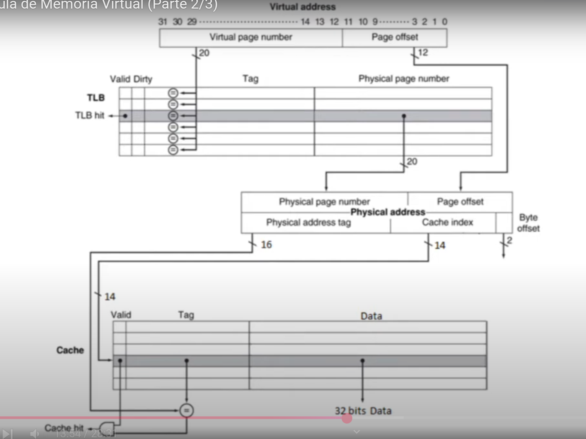

# TLB (Translation Lookaside Buffer) 

## TLB - Melhorando a tradução do endereço 

Cada acesso à memória exige, na verdade, *dois acessos à memória principal*:

* Um para *obter o endereço físico* (consulta à tabela de páginas) 
* Outro para *buscar a informação* 

Aposta na *localidade das referências à tabela de páginas*

* Quando um determinado número de página virtual for usado, provavelmente ele 
voltará a ser necessário em um futuro próximo (referências às palavras de uma 
página apresentam localidade espacial e temporal...)

Os processadores atuais possuem uma cache especial (muitas vezes, on-chip) que 
armazena as traduções de endereço mais recentes: **translation-lookaside-buffer 
TLB** 

---

## Tabela de Páginas + TLB 

A *TLB* é uma *cache que guarda somente resultados do mapeamento de endereços 
virtuais em endereços físicos* 

Dada uma entrada da TLB 

* O *tag* guarda uma *parte do número da página virtual* 
* O *campo de informação* guarda o *número do endereço físico correspondente* 

Em uma referência, *a tabela de páginas pode nem ser acessada*

Logo, cada entrada da TLB precisa ter também: 

* O *bit de residência* 
* Um *bit de modificação*, para caso de escrita 

--- 

## Faltas na TLB e Faltas na Página 

Se ocorrer uma falta no acesso à TLB, é preciso determinar 

* Se realmente foi falta no acesso à TLB 
* Se foi falta devida à falta de página

**Se a página estiver na memória principal**(falta no acesso à TLB)

* O processador trata a falta colocando na TLB as informações necessárias para 
realizar a tradução (as informações são trazidas da emmória principal) 
* O processador tenta novamente acessar a página a partir da TLB

**Se a página não estiver na memória principal**(falta de página) 

* O processador aciona o SO através de uma exceção 

## Faltas n TLB

$N^o$ de entradas na TLB $\lt$ $N^o$ de páginas na memória principal

* Faltas na TLB *são muito mais frequentes* que faltas de página 

Faltas na TLB podem ser tratadas 

* Por hardware 
* Por software 

Escolha de uma das entradas da TLB para ser substituída 

* *Bits de referência e de modificação* devem ser copiados de volta para a tabela 
de páginas, antes desta substituição 
* *Bits de referência e de modificação* são a única parte da TLB que não pode 
ser modificada 
* *write-back* é eficiente, uma vez que espera-se que a taxa de faltas na TLB 
seja pequena 

---

## Características da TLB 

---

## Proteção com Memória Virtual 

É função de um sistema de memória virtual: 

* *Permitir que uma única memória principal seja compartilhada por vários 
processor, oferecendo proteção a estes e ao SO* 

Mecanismo de proteção precisa garantir que: 

* Um *processo renegado* não possa escrever no espaço de endereçamento de outro 
processo de usuário ou no espaço do SO *intencionalmente ou não* 
* Um determinado processo leia os dados de outro processo 

Caso essas garantias não sejam satisfeitas, o compartilhamento da memória não 
será permitido 

Cada processo tem seu próprio espaço de endereçamento virtual 

Se o SO mantiver as tabelas de páginas organizadas de modo que *páginas virtuais 
independentes sejam mapeadas para páginas físicas disjuntas*, um processo *não 
será capaz de acessar as informações de outro*

Além disso, *um processo de usuário não pode ser capaz de modificar o mapeamento 
da tabela de páginas*

O SO proíbe o acesso de usuário de modificar sua própria tabela de páginas 

Mas o SO precisa poder modificar qualquer das tabelas de páginas 

Por isso, tableas de páginas são colocadas no espaço de endereçamento de SO 

No mínimo dois modos de processamento para indicar se *processo de usuário* ou 
*processo do SO* (user mode/kernel mode)

Processador *deve ter um estado* que *permite que um processo possa ler mas não 
possa escrever* (bit de user/kernel mode + TLB + um ponteiro para a tabela de 
páginas) 

Mecanismos para trocar de modo: 

* *user -> kernel*: feita via exceção de syscalls, implementada por uma instrução 
especial (**syscall**) 
* *kernel -> user*: executar a instrução **retorno de exceção (RFE)**

### Compartilhamento de informações entre processos 

Processos precisam de assistência do SO 

Bit de acesso à escrita pode ser usado para restringir o compartilhamento para 
uma simples leitura (e só pode ser modificado pelo SO) 

Para permitir que P1 leia uma página pertencente a P2: 

* P2 solicita ao SO a criação de uma entrada na tabela de páginas para uma 
página virtual no espaço de endereçamento de P1 que aponte para a mesma página 
física que ele (P2) deseja compartilhar 
* O SO pode usar o bit de escrita para evitar que P1 escreva informações 
acessadas (se P2 assim desejar) 
* Bits que determinem os direitos de acesso à páginas precisam ser incluídos 
tanto na tabela de páginas quanto na TLB

---
 
## Manipulação de Faltas de Páginas e de Faltas na TLB 

Uma *falta no acesso à TLB* ocorre quando nenhuma de suas entradas é igual ao 
endereço virtual gerado pelo processador 

Uma *falta no acesso á TLB* pode ter um dos seguintes desdobramentos:

* A página requisitada *está presente na memória* -> Basta criar uma nova entrada 
para ela na TLB 

* A página requisitada *não está presente na memória* -> É necessário transferir 
o controle para o SO, que vai tratar a falta de página 

**Tratamento de falta na TLB pode ser por sofware ou por hardware**

* Requer uma pequena sequência de operações para *copiar a entrada da tabela de 
páginas da memória principal* para a *TLB*

**O Tratamento de faltas de página requer uso do mecnaismo de exceção para**:

* Interromper o processo ativo 
* Transferir o controle para o SO, para mais tarde retomar o processo interrompido
* Falta de página geralmente é reconhecida durante o ciclo de clock usado para 
acessar a memória 
* PC é salvo em um registrador especial chamado *EPC Exception Program Counter*
a fim de poder retornar a execução a partir da próxima instrução 

Além disso, a exceção de falta de página precisa ser ativada no *final do mesmo 
ciclo* do acesso à memória

O próximo ciclo deve *começar o processamento da exceção*, e *não uma nova 
instrução do programa que estava em execução*

O *SO identifica o tipo de exceção (falta de página)*, salva todo o estado do 
processo ativo

Após avaliar o endereço virtual causador da exceção de falta (verifica se 
buscava dado ou instrução) de página, o SO executa 3 passos:

1. *Acessar* a entrada da tabela de páginas correspondente ao endereço virtual e 
encontrar a posição no disco da página referenciada 

2. *Escolher* uma página física para substituir 
    - *Avaliar* o bit de modificação, caso esteja ligado, a página deve ser 
    copiada para o disco 

3. *Iniciar a leitura no disco* da página referenciada para o endereço físico 
escolhido para abrigá-lo na memória principal 

Naturalmente o passo 3 vai consumir milhares de ciclos de clock, assim como o 
passo 2 no caso do bit de modificação estar ligado 

O SO *define outro processo para ser executado* até que o acesso ao disco termine 

Após o acesso ao disco, o SO retorna ao processo que gerou a falta de página, 
executando a instrução de retorno de exceção 

Esta instrução faz com que o processador volte ao modo usuário, além de restaurar
o valor do PC

As exceções por faltas de dados são mais difíceis de implementar devido a 3 
fatores:

1. Elas ocorrem no meio da execução de uma instrução 

2. A execução da instrução não termina enquanto a exceção não for tratada 

3. Após o tratamento da exceção, a instrução deve ser executada novamente como 
se a falta não tivesse ocorrido 

---

## Observações Finais 

A *gerência da memória virtual é um grande desafio* devido o *alto custo das 
faltas de página*

Várias técnicas são usadas para resolver esse problema: 

1. As páginas devem ser *grandes o suficiente* para tirar proveito da *localidade 
espacial*

2. O *mapeamento de um endereço virtual em um endereço físico* usando a tabela de 
páginas é feito de maneira *totalmente associativa*

3. O SO usa técnicas especiais (e.g. *LRU e bit de referência*) para determinar 
*qual das páginas deve ser substituída*.

**As escritas no disco também são muito caras**

* Usa o esquema *write-back* 
* Controle se uma página não foi modificada para evitar a escrita de páginas que 
não foram modificadas *bit de modificação*

**Mecanismo de memória virtual**

* Realiza a tradução de endereço virtual para o espaço de endereçamento físico 
(usado no acesso à memória principal)
* Permite o compartilhamento protegido da memória principal entre diversos 
processos 
* Simplifica a alocação da memória 

**A TLB funciona como uma cache para as traduções da tabela de páginas, 
armazenando os endereços físicos recentemente acessados**

---

## Onde se pode colocar um bloco? 

A colocação de um bloco no nível superior da hierarquia pode usar um dos seguintes 
esquemas: 

* Mapeamento direto 
* Mapeamento associativo por conjunto (caso genérico)
* Mapeamento totalmente associativo

---

## Como encontrar um bloco? 

Depende do esquema adotado para colocação dos blocos 

Nos sistemas de memória virtual, a *tabela de páginas* é usada para indexar a memória 
principal

Fatores que motivam o *mapeamento totalmente assocaitivo* nas tabelas de páginas: 

1. Alto custo das faltas de página 
2. Permite que o software utilize algoritmos bastante sofisticados para substituição 
de página 
3. Pode ser failmente indexado, sem necessidade de hardware extra 
4. Quanto maior o tamanho da página, menor o overhead relativo representado pelo tamanho 
da tabela de páginas 

Caches e TLBs normalmente usam esquema *associativo por conjunto* 

Acesso combina indexação e busca em um conjunto pequeno de elementos 

Porém, alguns sistemas mais recentes têm usado caches com *mapeamento direto* devido ao 
pequeno tempo de acesso e simplicidade 

---

## Qual dos blocos deve ser substituído? 

*Totalmente associativa*: todos os blocos são candidatos à substituição 

*Conjunto associativo*: escolher um dos blocos pertencentes a um conjunto 

*Mapeamento direto*: não há escolha! 

Estratégias para a substituição de blocos: **RANDOM, LRU, FIFO**

---

## Vantagens do Write-back 

* As palavras podem ser escritas individualmente pelo processador na velocidade da cache, 
ao invés da velocidade da memória principal 

* Escritas múltiplas dentro de um bloco podem ser feitas com uma única operação de escrita 
no componente da hierarquia inferior 

* Quando os blocos são escritos de volta, o sistema pode fazer uso de uma banda passante 
extremamente alta para efetivar a transferência, já que todo o bloco é escrito 
